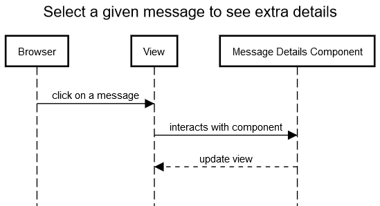

# Rotavator

Simple MEAN application exposing a REST API for messages and determining whether they are palindromes. The API is REST-like in that messages are accessed and modified by using unique URLs that apply HTTP verbs: GET, POST, and DELETE.

The [MEAN stack](http://mean.io/) was chosen because of:
* Node.js has good support for rapid development of HTTP servers with a REST-like API
* Being a good platform for I/O-bound applications
* Vast user community

It isn't a good platform for computationally intensive ones though.

[Elixir](http://elixir-lang.org/) is another great option for message based systems, but has a steeper learning curve.

Messages are stored in a Mongo database. Node.JS and Express acts as the server. Angular 2 serves the UI.

This app was generated with [Angular CLI](https://github.com/angular/angular-cli) version 1.0.0-rc.2.

## Prerequisites

This app requires a Mongo database, or actually two: one for development, one for testing. The same database can theoretically be used for both development and testing, but that is discouraged.

Specify the development database via the environment variable `MONGODB_URI`.

Specify the testing database via the environment variable `MONGODB_TEST_URI`.

There are several free options for running a Mongo database:
* Host it [locally](https://docs.mongodb.com/manual/installation/)
* Use a free plan at [mLab](https://mlab.com/)
* Use a free plan at [MongoDB Atlas](https://www.mongodb.com/cloud/atlas/pricing)

[Node.JS](https://nodejs.org/) is also required.

[Docker](https://www.docker.com/) is required if the app will be run as a docker container.

## Configuration

Configurations are managed in the `config/` folder. It is optional to change the content of these.

## Build app locally

1. Run `npm install` to build the project. The build artifacts will be stored in the `dist/` directory.
2. Make sure a Mongo database has been set up and specified via the appropriate environment variable, see Configuration section.
3. Run `npm start` to start the server.
4. Navigate to [`http://localhost:8080/`](http://localhost:8080/).

## Update API documentation locally

1. Run `npm run apidoc` to generate the API documentation. Help will be generated in the `dist/apidoc` directory.
2. Navigate to [`http://localhost:8080/apidoc`](http://localhost:8080/apidoc).

## Running functional tests

Run `npm test` to execute functional tests via [Mocha](https://mochajs.org/).

## Docker

The app is available on Docker Hub.

The source code also contains a Dockerfile for building an image locally. There is also a .dockerignore file.

### Pull image from Docker Hub

`docker pull karljohangrahn/rotavator`

### Build image

`docker build -t <your username>/rotavator .`

### Run image

1. Make sure a Mongo database has been set up and specified via the appropriate environment variable, see Configuration section.
2. `docker run -d -e MONGODB_URI="mongodb://<MONGODB_URI>" -p 8080:8080 <IMAGE ID>`
3. Navigate to [`http://localhost:8080/`](http://localhost:8080/).

## Deploy to AWS

1. Create an AWS account and put the `AWS_ID`, `AWS_SECRET`, and `AWS_REGION` in corresponding environment variables.
2. Generate an SSH RSA (not DSA) key with `ssh-keygen` if there is not already one.
3. Create a VM:
$ node_modules/.bin/awsbox create -n myvm
4. Deploy your code:
$ git push myvm HEAD:master
5. Visit `http://<my ip address>`.

## Sequence diagrams

### Show the list of messages posted by the users

### Post a new message

### Select a given message to see extra details

## License

MIT